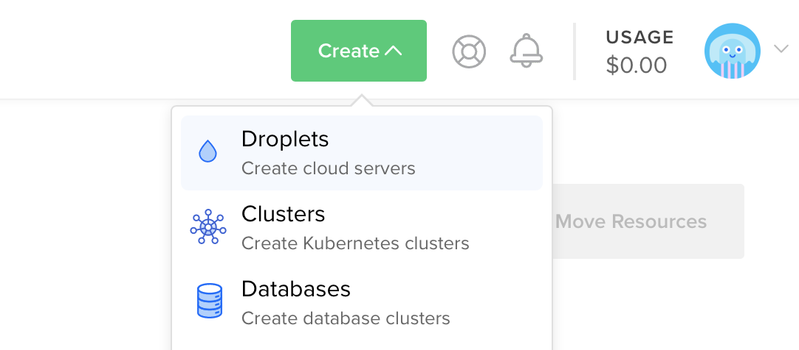
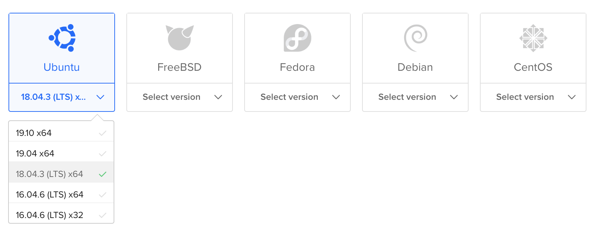

# Deploying to DigitalOcean

This guide will walk you through deploying SwiftNIO's [example HTTP server](https://github.com/apple/swift-nio/tree/master/Sources/NIOHTTP1Server) to a [Droplet](https://www.digitalocean.com/products/droplets/). To follow this guide, you will need to have a [DigitalOcean](https://www.digitalocean.com) account with billing configured.

## Create Server

Let's start by installing Swift on an Ubuntu server. Use the create menu to create a new Droplet.



Under distributions, select Ubuntu 18.04 LTS.



> Note: You may select any version of Linux that Swift supports. You can check which operating systems are officially supported on the [Swift Releases](https://swift.org/download/#releases) page.

After selecting the distribution, choose any plan and datacenter region you prefer. Then setup an SSH key to access the server after it is created. Finally, click create Droplet and wait for the new server to spin up.

Once the new server is ready, hover over the Droplet's IP address and click copy.


## Initial Setup

Open your terminal and connect to the server as root using SSH.

```sh
ssh root@your_server_ip
```

DigitalOcean has an in-depth guide for [initial server setup on Ubuntu 18.04](https://www.digitalocean.com/community/tutorials/initial-server-setup-with-ubuntu-18-04). This guide will quickly cover the basics.

### Configure Firewall

Allow OpenSSH through the firewall and enable it.

```sh
ufw allow OpenSSH
ufw enable
```

### Add User

Create a new user besides `root`. This guide calls the new user `swift`.

```sh
adduser swift
```

Allow the newly created user to use `sudo`.

```sh
usermod -aG sudo swift
```

Copy the root user's authorized SSH keys to the newly created user. This will allow you to SSH in as the new user.

```sh
rsync --archive --chown=swift:swift ~/.ssh /home/swift
```

Finally, exit the current SSH session and login as the newly created user. 

```sh
exit
ssh swift@your_server_ip
```

Then enable HTTP ports.

```sh
sudo ufw allow http
```

Your DigitalOcean virtual machine is now ready. Continue using the [Ubuntu](ubuntu.md) guide. 
