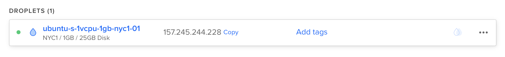

# Deploying to DigitalOcean

This guide will walk you through deploying SwiftNIO's [example HTTP server](https://github.com/apple/swift-nio/tree/master/Sources/NIOHTTP1Server) to a [Droplet](https://www.digitalocean.com/products/droplets/). To follow this guide, you will need to have a [DigitalOcean](https://www.digitalocean.com) account with billing configured.

## Create Server

Let's start by installing Swift on an Ubuntu server. Use the create menu to create a new Droplet.


Under distributions, select Ubuntu 18.04 LTS.


!!! note 
	You may select any version of Ubuntu that Swift supports. At the time of writing, Swift 5.2 supports 16.04 and 18.04. You can check which operating systems are officially supported on the [Swift Releases](https://swift.org/download/#releases) page.

After selecting the distribution, choose any plan and datacenter region you prefer. Then setup an SSH key to access the server after it is created. Finally, click create Droplet and wait for the new server to spin up.

Once the new server is ready, hover over the Droplet's IP address and click copy.



## Initial Setup

Open your terminal and connect to the server as root using SSH.

```sh
ssh root@your_server_ip
```

DigitalOcean has an in-depth guide for [initial server setup on Ubuntu 18.04](https://www.digitalocean.com/community/tutorials/initial-server-setup-with-ubuntu-18-04). This guide will quickly cover the basics.

### Configure Firewall

Allow OpenSSH through the firewall and enable it.

```sh
ufw allow OpenSSH
ufw enable
```

### Add User

Create a new user besides `root`. This guide calls the new user `swift`.

```sh
adduser swift
```

Allow the newly created user to use `sudo`.

```sh
usermod -aG sudo swift
```

Copy the root user's authorized SSH keys to the newly created user. This will allow you to SSH in as the new user.

```sh
rsync --archive --chown=swift:swift ~/.ssh /home/swift
```

Finally, exit the current SSH session and login as the newly created user. 

```sh
exit
ssh swift@your_server_ip
```

## Install Swift

Now that you've created a new Ubuntu server and logged in as a non-root user you can install Swift. 

### Swift Dependencies

Install Swift's required dependencies.

```sh
sudo apt-get update
sudo apt-get install clang libicu-dev libatomic1 build-essential pkg-config
```

### Download Toolchain

This guide will install Swift 5.2.0. Visit the [Swift Downloads](https://swift.org/download/#releases) page for a link to latest release. Copy the download link for Ubuntu 18.04.


Download and decompress the Swift toolchain.

```sh
wget https://swift.org/builds/swift-5.2-release/ubuntu1804/swift-5.2-RELEASE/swift-5.2-RELEASE-ubuntu18.04.tar.gz
tar xzf swift-5.2-RELEASE-ubuntu18.04.tar.gz
```

!!! note
	Swift's [Using Downloads](https://swift.org/download/#using-downloads) guide includes information on how to verify downloads using PGP signatures.

### Install Toolchain

Move Swift somewhere easy to acess. This guide will use `/swift` with each compiler version in a subfolder. 

```sh
sudo mkdir /swift
sudo mv swift-5.2-RELEASE-ubuntu18.04 /swift/5.2.0
```

Add Swift to `/usr/bin` so it can be executed by `vapor` and `root`.

```sh
sudo ln -s /swift/5.2.0/usr/bin/swift /usr/bin/swift
```

Verify that Swift was installed correctly.

```sh
swift --version
```

## Setup Project

Now that Swift is installed, let's clone and compile your project. For this example, we'll be using SwiftNIO's [example HTTP server](https://github.com/apple/swift-nio/tree/master/Sources/NIOHTTP1Server).

First let's install SwiftNIO's system dependencies.

```sh
sudo apt-get install zlib1g-dev
```

Allow HTTP through the firewall.

```sh
sudo ufw allow http
```

### Clone & Build

Now clone the project and build it.

```sh
git clone https://github.com/apple/swift-nio.git
cd swift-nio
swift build
```

!!! tip
	If you are building this project for production, use `swift build -c release`

### Run

Once the project has finished compiling, run it on your server's IP at port 80.

```sh
sudo .build/debug/NIOHTTP1Server 157.245.244.228 80
```

If you used `swift build -c release`, then you need to run:
```sh
sudo .build/release/NIOHTTP1Server 157.245.244.228 80
```

Visit your server's IP via browser or local terminal and you should see "It works!".

```
$ curl http://157.245.244.228
Hello world!
```

Use `CTRL+C` to quit the server.

Congratulations on getting your Swift server app running on a DigitalOcean Droplet!
